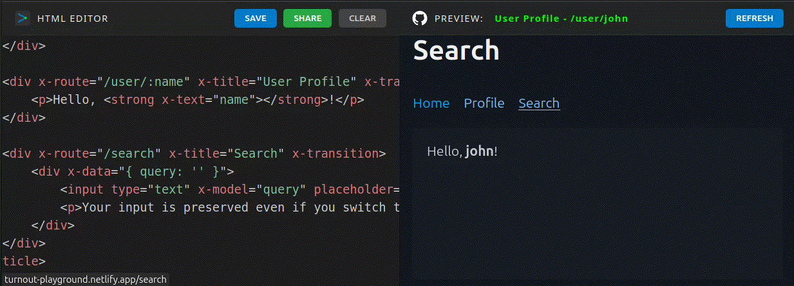

# Alpine Turnout

[](https://alpine-turnout.netlify.app/)

## A lightweight **SPA Switch** for **Alpine.js** built for speed and **state persistence**.

Unlike traditional routers that destroy and recreate DOM elements on every navigation, **Alpine Turnout** focuses on **DOM preservation**.

It treats your routes like railroad tracks: every section stays "alive" in the DOM. This preserves the internal state—meaning **input fields, scroll positions, and component variables remain exactly as the user left them**—while the "Turnout" logic reactively switches the view and URL to the correct destination.

[](https://turnout-playground.netlify.app/)

## Why Turnout?

-   **Zero-Config:** just setup your `html` layout like normally and use the `x-route` attribute to declare the "tracks".

-   **Persistence:** Forms, scroll positions, and component data are preserved when navigating away and back.
    
-   **Instant Switching:** No re-mounting or re-fetching logic on every click.
    
-   **Alpine-Native:** Uses a global store and works with a single directive.
    
-   **Transitions:** Works seamlessly with Alpine's `x-transition`.

-   **Super Small** The alpine-turnout code is only 2.00 kB (gzip: 0.94 kB)

-   **SEO Proof:** All your content gets indexed by the popular search engines like `Google`, `DuckDuckGo` etc.
    
----------

## Kickstart

### Turnout Playground Example 1
[](https://turnout-playground.netlify.app/?code=PCFET0NUWVBFIGh0bWw-CjxodG1sPgo8aGVhZD4KICA8dGl0bGU-QWxwaW5lIFR1cm5vdXQ8L3RpdGxlPgogIDxzY3JpcHQgc3JjPSIvL3VucGtnLmNvbS9hbHBpbmUtdHVybm91dCIgZGVmZXI-PC9zY3JpcHQ-CiAgPHNjcmlwdCBzcmM9Ii8vdW5wa2cuY29tL2FscGluZWpzIiBkZWZlcj48L3NjcmlwdD4KPC9oZWFkPgo8Ym9keSB4LWRhdGE-CiAgPG5hdj4KICAgIDxhIGhyZWY9Ii8iPkFscGluZTwvYT4gfCAKICAgIDxhIGhyZWY9Ii90dXJub3V0Ij5UdXJub3V0PC9hPiB8CiAgICA8YiB4LXRleHQ9IiRzdG9yZS50dXJub3V0LnRpdGxlIj48L2I-CiAgPC9uYXY-CgogIDxkaXYgeC1yb3V0ZT0iLyIgeC10aXRsZT0iQWxwaW5lIEhvbWUiPgogICAgPHA-Q2xpY2sgdGhyb3VnaCB0aGUgbWVudS48L3A-CiAgPC9kaXY-CgogIDxkaXYgeC1yb3V0ZT0iL3R1cm5vdXQiIHgtdGl0bGU9IlR1cm5vdXQgUm91dGUiPgogICAgPHA-V2UganVzdCB0dXJuZWQgb3V0IHRvIGJlIGhlcmUuPC9wPgogIDwvZGl2Pgo8L2JvZHk-CjwvaHRtbD4)

### Turnout Playground Example 2
[](https://turnout-playground.netlify.app/?code=PCFET0NUWVBFIGh0bWw-CjxodG1sIGxhbmc9ImVuIj4KPGhlYWQ-CiAgICA8bWV0YSBjaGFyc2V0PSJVVEYtOCI-CiAgICA8dGl0bGU-QWxwaW5lIFR1cm5vdXQ8L3RpdGxlPgogICAgPHNjcmlwdCBzcmM9Ii8vdW5wa2cuY29tL2FscGluZS10dXJub3V0IiBkZWZlcj48L3NjcmlwdD4KICAgIDxzY3JpcHQgc3JjPSIvL3VucGtnLmNvbS9hbHBpbmVqcyIgZGVmZXI-PC9zY3JpcHQ-CiAgICA8bGluayByZWw9InN0eWxlc2hlZXQiIGhyZWY9Ii8vdW5wa2cuY29tL0BwaWNvY3NzL3BpY28iPgo8L2hlYWQ-Cjxib2R5IGNsYXNzPSJjb250YWluZXIiIHgtZGF0YT4KCiAgICA8aDEgeC1kYXRhIHgtdGV4dD0iJHN0b3JlLnR1cm5vdXQudGl0bGUiPjwvaDE-CgogICAgPG5hdj4KICAgICAgICA8dWw-CiAgICAgICAgICAgIDxsaT48YSBocmVmPSIvIj5Ib21lPC9hPjwvbGk-CiAgICAgICAgICAgIDxsaT48YSBocmVmPSIvdXNlci9qb2huIj5Qcm9maWxlPC9hPjwvbGk-CiAgICAgICAgICAgIDxsaT48YSBocmVmPSIvc2VhcmNoIj5TZWFyY2g8L2E-PC9saT4KICAgICAgICA8L3VsPgogICAgPC9uYXY-CgogICAgPGFydGljbGU-CiAgICAgICAgPGRpdiB4LXJvdXRlPSIvIiB4LXRpdGxlPSJXZWxjb21lIEhvbWUiIHgtdHJhbnNpdGlvbj4KICAgICAgICAgICAgPHA-VGhpcyBpcyB0aGUgaG9tZXBhZ2UuPC9wPgogICAgICAgIDwvZGl2PgoKICAgICAgICA8ZGl2IHgtcm91dGU9Ii91c2VyLzpuYW1lIiB4LXRpdGxlPSJVc2VyIFByb2ZpbGUiIHgtdHJhbnNpdGlvbj4KICAgICAgICAgICAgPHA-SGVsbG8sIDxzdHJvbmcgeC10ZXh0PSJuYW1lIj48L3N0cm9uZz4hPC9wPgogICAgICAgIDwvZGl2PgoKICAgICAgICA8ZGl2IHgtcm91dGU9Ii9zZWFyY2giIHgtdGl0bGU9IlNlYXJjaCIgeC10cmFuc2l0aW9uPgogICAgICAgICAgICA8ZGl2IHgtZGF0YT0ieyBxdWVyeTogJycgfSI-CiAgICAgICAgICAgICAgICA8aW5wdXQgdHlwZT0idGV4dCIgeC1tb2RlbD0icXVlcnkiIHBsYWNlaG9sZGVyPSJUeXBlIGhlcmUuLi4iPgogICAgICAgICAgICAgICAgPHA-WW91ciBpbnB1dCBpcyBwcmVzZXJ2ZWQgZXZlbiBpZiB5b3Ugc3dpdGNoIHRhYnMhPC9wPgogICAgICAgICAgICA8L2Rpdj4KICAgICAgICA8L2Rpdj4KICAgIDwvYXJ0aWNsZT4KCjwvYm9keT4KPC9odG1sPg)

### Turnout Playground Example 3
[](https://turnout-playground.netlify.app/?code=PCFET0NUWVBFIGh0bWw-CjxodG1sIGxhbmc9ImVuIj4KPGhlYWQ-CiAgICA8bWV0YSBjaGFyc2V0PSJVVEYtOCI-CiAgICA8dGl0bGU-QWxwaW5lIFR1cm5vdXQ8L3RpdGxlPgogICAgPHNjcmlwdCBzcmM9Ii8vdW5wa2cuY29tL2FscGluZS10dXJub3V0IiBkZWZlcj48L3NjcmlwdD4KICAgIDxzY3JpcHQgc3JjPSIvL3VucGtnLmNvbS9hbHBpbmVqcyIgZGVmZXI-PC9zY3JpcHQ-CiAgICA8bGluayByZWw9InN0eWxlc2hlZXQiIGhyZWY9Ii8vdW5wa2cuY29tL0BwaWNvY3NzL3BpY28iPgo8L2hlYWQ-Cjxib2R5IGNsYXNzPSJjb250YWluZXIiIHgtZGF0YT4KCiAgICA8aDEgeC1kYXRhIHgtdGV4dD0iJHN0b3JlLnR1cm5vdXQudGl0bGUiPjwvaDE-CgogICAgPG5hdj4KICAgICAgICA8dWw-CiAgICAgICAgICAgIDxsaT48YSBocmVmPSIvIj5Ib21lPC9hPjwvbGk-CiAgICAgICAgICAgIDxsaT48YSBocmVmPSIvdXNlci9qb2huIj5Qcm9maWxlPC9hPjwvbGk-CiAgICAgICAgICAgIDxsaT48YSBocmVmPSIvc2VhcmNoIj5TZWFyY2g8L2E-PC9saT4KICAgICAgICA8L3VsPgogICAgPC9uYXY-CgogICAgPGFydGljbGU-CiAgICAgICAgPGRpdiB4LXJvdXRlPSIvIgogICAgICAgICAgICAgeC10aXRsZT0iSG9tZSIKICAgICAgICAgICAgIHgtYXJyaXZlPSJjb25zb2xlLmxvZygnV2VsY29tZScpIgogICAgICAgICAgICAgeC1sZWF2ZT0iY29uc29sZS5sb2coJ0J5ZScpIgogICAgICAgICAgICAgeC10cmFuc2l0aW9uPgogICAgICAgICAgICA8cD5UaGlzIGlzIHRoZSBob21lcGFnZS48L3A-CiAgICAgICAgPC9kaXY-CgogICAgICAgIDxkaXYgeC1yb3V0ZT0iL3VzZXIvOm5hbWUiIHgtdGl0bGU9IlVzZXIgUHJvZmlsZSIgeC10cmFuc2l0aW9uPgogICAgICAgICAgICA8cD5IZWxsbywgPHN0cm9uZyB4LXRleHQ9Im5hbWUiPjwvc3Ryb25nPiE8L3A-CiAgICAgICAgPC9kaXY-CgogICAgICAgIDxkaXYgeC1yb3V0ZT0iL3NlYXJjaCIgeC10aXRsZT0iU2VhcmNoIiB4LXRyYW5zaXRpb24-CiAgICAgICAgICAgIDxkaXYgeC1kYXRhPSJ7IHF1ZXJ5OiAnJyB9Ij4KICAgICAgICAgICAgICAgIDxpbnB1dCB0eXBlPSJ0ZXh0IiB4LW1vZGVsPSJxdWVyeSIgcGxhY2Vob2xkZXI9IlR5cGUgaGVyZS4uLiI-CiAgICAgICAgICAgICAgICA8cD5Zb3VyIGlucHV0IGlzIHByZXNlcnZlZCBldmVuIGlmIHlvdSBzd2l0Y2ggdGFicyE8L3A-CiAgICAgICAgICAgIDwvZGl2PgogICAgICAgIDwvZGl2PgogICAgPC9hcnRpY2xlPgoKPC9ib2R5Pgo8L2h0bWw-)


----------

## Installation

### Via CDN (recommended)

Include the script before Alpine.js:

```html
<script src="https://unpkg.com/alpine-turnout" defer></script>
<script src="https://unpkg.com/alpinejs" defer></script>
```

### Via NPM module

Install Alpine Turnout:

```bash
npm install alpine-turnout
```

Initialize Alpine.js and Alpine Turnout as modules with the following code:

```js
import Alpine from 'alpinejs';
import AlpineTurnout from 'alpine-turnout';

Alpine.plugin(AlpineTurnout);
Alpine.start();
```

Then launch your dev environment with vite:

```bash
npm run dev
```
----------

## Usage

### 1. Define your tracks(/routes)

Create a `nice` layout in `html`. Then use the `x-route` and `x-title` directives:

```html
<!doctype html>
<html lang="en">
<head>
    <meta charset="UTF-8">
    <title>Alpine Turnout</title>
    <script src="//unpkg.com/alpine-turnout" defer></script>
    <script src="//unpkg.com/alpinejs" defer></script>
    <link rel="stylesheet" href="//unpkg.com/@picocss/pico">
</head>
<body class="container" x-data="{}">

    <h1 x-data x-text="$store.turnout.title"></h1>

    <nav>
        <ul>
            <li><a href="/">Home</a></li>
            <li><a href="/user/john">Profile</a></li>
            <li><a href="/search">Search</a></li>
        </ul>
    </nav>

    <article>
        <div x-route="/" x-title="Welcome Home" x-transition>
            <p>This is the homepage.</p>
        </div>

        <div x-route="/user/:name" x-title="User Profile" x-transition>
            <p>Hello, <strong x-text="name"></strong>!</p>
        </div>

        <div x-route="/search" x-title="Search" x-transition>
            <div x-data="{ query: '' }">
                <input type="text" x-model="query" placeholder="Type here...">
                <p>Your input is preserved even if you switch tabs!</p>
            </div>
        </div>
    </article>

</body>
</html>
```

- [Go Here](https://alpine-turnout.netlify.app) for a more `extensive` live example!

- [Go Here](https://m-bassy.netlify.app) for a more functional `note app` live example!

- [Go Here](https://studio-manager-app.netlify.app) for a demonstration `studio app` live example!

- [Go Here](https://github.com/rodezee/alpine-turnout/tree/main/examples) and check out our `/examples/*` directory for more.

### 2. Navigation

Turnout automatically intercepts any internal `<a href="/user/john">Visit John</a>` links. You can also navigate programmatically:

```html
<button @click="$store.turnout.go('/user/john')">Visit John</button>

```

----------

## How it Works

When you define an `x-route`, Alpine Turnout does three things:

1.  **Registers the path:** Adds the pattern to a global registry.
    
2.  **Injects Scope:** Makes route parameters (like `:name`) available directly to the HTML inside that div.
    
3.  **Manages Visibility:** Uses `x-show` logic under the hood. When the URL matches, the "track" becomes visible; otherwise, it is hidden with `display: none`.
    
----------

## API Reference

### Global Store: `$store.turnout`

Property | Type | Description
 --- | --- | ---
`path` | `String` | The current URL pathname.
`title` | `String` | The value of `x-title` for the active route.
`notFound` | `Boolean` | True if the current path matches no registered routes.
`go(path)` | `Function` | Programmatically navigate to a new route.

### Directives

#### x-route="[path]"

Used on a `div` or `section` to define a "track". Elements with this directive are automatically toggled based on the URL.

- **Static Routes:** `x-route="/about"`
    
- **Dynamic Routes:** `x-route="/post/:id"` (makes `id` available in local scope).
    
- **Wildcard (Custom 404):** `x-route="*"`


#### x-arrive="[expression]"

The "Arrival" hook. Fires every time the route becomes active.

- Use this to fetch fresh data or reset a form when the user navigates to the page.

- Example: x-arrive="getWeather()"


#### x-leave="[expression]"

The "Departure" hook. Fires when the user navigates away from this route.

- Use this to stop timers, cancel requests, or save draft data.

- Example: x-leave="stopAutoRefresh()"

----------

### Features & Behavior


#### 📜 Scroll Memory

Alpine Turnout automatically remembers the scroll position of every route.

- When navigating via links, it returns you to your previous scroll depth on that specific "track".

- When clicking a new unique path for the first time, it defaults to the top (0,0) with a smooth behavior.


#### ⚓ Anchor Support (#hash)

The router detects fragment identifiers. If a URL contains a #, the router will:

- Resolve the correct x-route.

- Wait for the DOM to render.

- Smoothly scroll the element with the matching id into view.


#### 🛰️ Link Interception

Standard `<a>` tags are intercepted automatically if they point to an internal path (starting with /).

- Internal links: Trigger an Alpine Turnout "switch" without a page reload.

- External/Hash-only links: Ignored by the router, allowing standard browser behavior.


#### Default 404 Behavior

If no `x-route="*"` is found and the user hits an unregistered path, Turnout automatically injects a "Dead End" 404 section into your `main` element to prevent a blank screen.


#### Transitions

Because Turnout uses Alpine's visibility toggling, you can use standard transitions. Note that we recommend setting a `leave.duration.0ms` if you want the "old" page to disappear instantly while the new one fades in.

```html
<div x-route="/fast" 
     x-transition.duration.500ms 
     x-transition:leave.duration.0ms>
    ...
</div>
```

----------

## Comparison with alpine-router(s)

Subject | alpine-router(s) | **alpine-turnout**
 --- | --- | ---
**DOM Logic** | Destroys/Creates | Hides/Shows (**Persistent**)
**State** | Reset on nav | Preserved (Forms/Input)
**Performance** | Lower Memory | Faster Switching
**Best For** | Massive apps | One-pagers & Dashboards

----------

## SEO Proof

Most modern routers (React Router, Vue Router) are "empty" until JavaScript runs. Bots often see a blank page on the first pass.  

Alpine Turnout’s Edge: Since all your "tracks" (the divs with x-route) are physically present in your HTML file, a crawler like Googlebot sees all your content immediately when it reads the source code.  

The Result: Your internal pages are indexed much more easily than with a standard SPA.  

----------

## 🚀 Deployment

Since this is a Single Page Application (SPA) using the `History API`, your web server should be configured to serve `index.html` for all requests that don't match a static file.

### Example for Nginx:

```nginx
location / {
    try_files $uri $uri/ /index.html;
}
```

### Example for Netlify:

Simply include a file named `netlify.toml` in the publish directory of your repository:
```
[[redirects]]
  from = "/*"
  to = "/index.html"
  status = 200
```

----------

## 🧪 Testing

This project is tested using **Vitest** and **JSDOM**. Because Alpine.js initializes asynchronously, the test suite ensures that routes are correctly registered and cleared.

To run the tests:

```bash
npm install
npm test
```

### Test Cases

Our suite covers the following test cases:

- initializes and shows the home route by default

- navigates to a parameterized "track" and updates the view

- updates parameters reactively without re-mounting the element

- renders a 404 terminal when a "track" is not found

- persists state (like attributes or input) when switching "tracks"

- intercepts internal links and prevents default behavior

- ignores external links and allows standard navigation

----------

## ⚖️ License

MIT © [Github](https://github.com/rodezee/alpine-turnout) [NPM](https://www.npmjs.com/package/alpine-turnout)
